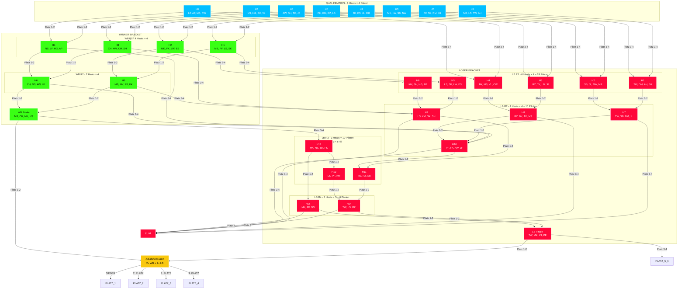

# FPV Racing Heats - Dynamischer Turnierbaum (32 Piloten)

## Neue Regelstruktur nach Epic 12

```
╔══════════════════════════════════════════════════════════════════════════════════════════════════════════════════════════════╗
║                                              QUALIFIKATION (8 Heats × 4 Piloten = 32 Piloten)                                   ║
╠══════════════════════════════════════════════════════════════════════════════════════════════════════════════════════════════╣
║  H1           H2           H3           H4           H5           H6           H7           H8                                    ║
║ ┌───┐        ┌───┐        ┌───┐        ┌───┐        ┌───┐        ┌───┐        ┌───┐        ┌───┐                                 ║
║ │1 2│        │1 2│        │1 2│        │1 2│        │1 2│        │1 2│        │1 2│        │1 2│                                 ║
║ │3 4│        │3 4│        │3 4│        │3 4│        │3 4│        │3 4│        │3 4│        │3 4│                                 ║
║ └───┘        └───┘        └───┘        └───┘        └───┘        └───┘        └───┘        └───┘                                 ║
║   ↓            ↓            ↓            ↓            ↓            ↓            ↓            ↓                                      ║
║  WB           WB           WB           WB           WB           WB           WB           WB           (Platz 1-2 → WB)            ║
║  LB           LB           LB           LB           LB           LB           LB           LB           (Platz 3-4 → LB)            ║
╚══════════════════════════════════════════════════════════════════════════════════════════════════════════════════════════════╝
                                                  ↓
                              ┌───────────────────┴───────────────────┐
                              ↓                                       ↓
                ╔═══════════════════════════════════════════════════════════════════════╗
                ║                      WINNER BRACKET (7 Heats)                          ║
                ╠═══════════════════════════════════════════════════════════════════════╣
                ║                                                                              ║
                ║  WB RUNDE 1 (4 Heats × 4 = 16 Piloten)                                         ║
                ║  ┌───┐  ┌───┐  ┌───┐  ┌───┐                                                       ║
                ║  │H1 │  │H2 │  │H3 │  │H4 │                                                       ║
                ║  │   │  │   │  │   │  │   │                                                       ║
                ║  └───┘  └───┘  └───┘  └───┘                                                       ║
                ║    ↓      ↓      ↓      ↓                                                         ║
                ║    └──────┴──────┴──────┘                                                         ║
                ║              ↓                                                                    ║
                ║  WB RUNDE 2 (2 Heats × 4 = 8 Piloten)                                         ║
                ║  ┌───┐  ┌───┐                                                                   ║
                ║  │H5 │  │H6 │                                                                   ║
                ║  │   │  │   │                                                                   ║
                ║  └───┘  └───┘                                                                   ║
                ║    ↓      ↓                                                                     ║
                ║    └──────┴──────┐                                                                ║
                ║                   ↓                                                               ║
                ║  WB FINALE (1 Heat × 4 = 4 Piloten)                                            ║
                ║  ┌─────┐                                                                        ║
                ║  │FIN  │                                                                        ║
                ║  │     │                                                                        ║
                ║  └─────┘                                                                        ║
                ║         ↓                    ↓                                                   ║
                ║          └────────────────────┴────────────────────────────────────────────────┐  ║
                ║                                                                                  ↓  ║
                ╚════════════════════════════════════════════════════════════════════════════════════╝
                                                                                                         ↓
                              ┌────────────────────────────────────────────────────────────────────────┘
                              ↓
                ╔═══════════════════════════════════════════════════════════════════════════════════════════════════════════════╗
                ║                                   LOSER BRACKET (16 Heats)                                                      ║
                ╠═══════════════════════════════════════════════════════════════════════════════════════════════════════════════╣
                ║                                                                                                                       ║
                ║  LB RUNDE 1 (6 Heats × 4 = 24 Piloten)                                                                               ║
                ║  ┌───┐ ┌───┐ ┌───┐ ┌───┐ ┌───┐ ┌───┐                                                                               ║
                ║  │H1 │ │H2 │ │H3 │ │H4 │ │H5 │ │H6 │                                                                               ║
                ║  │   │ │   │ │   │ │   │ │   │ │   │                                                                               ║
                ║  └───┘ └───┘ └───┘ └───┘ └───┘ └───┘                                                                               ║
                ║    ↓      ↓      ↓      ↓      ↓      ↓                                                                             ║
                ║    └──────┴──────┴──────┴──────┴──────┘                                                                             ║
                ║              ↓                                                                                                       ║
                ║  LB RUNDE 2 (4 Heats × 4 = 16 Piloten)                                                                               ║
                ║  ┌───┐ ┌───┐ ┌───┐ ┌───┐                                                                                           ║
                ║  │H7 │ │H8 │ │H9 │ │H10│                                                                                           ║
                ║  │   │ │   │ │   │ │   │                                                                                           ║
                ║  └───┘ └───┘ └───┘ └───┘                                                                                           ║
                ║    ↓      ↓      ↓      ↓                                                                                           ║
                ║    └──────┴──────┴──────┘                                                                                           ║
                ║              ↓                                                                                                       ║
                ║  LB RUNDE 3 (3 Heats: 2×3 + 1×4 = 10 Piloten)                                                                        ║
                ║       ┌───┐  ┌───┐  ┌─────┐                                                                                         ║
                ║       │H11 │  │H12 │  │H13  │                                                                                         ║
                ║       │3x  │  │3x  │  │4x   │                                                                                         ║
                ║       └───┘  └───┘  └─────┘                                                                                         ║
                ║         ↓      ↓       ↓                                                                                            ║
                ║         └──────┴───────┘                                                                                            ║
                ║                   ↓                                                                                                  ║
                ║  LB RUNDE 4 (2 Heats × 3 = 6 Piloten)                                                                                ║
                ║       ┌───┐  ┌───┐                                                                                                  ║
                ║       │H14 │  │H15 │                                                                                                  ║
                ║       │3x  │  │3x  │                                                                                                  ║
                ║       └───┘  └───┘                                                                                                  ║
                ║         ↓      ↓                                                                                                    ║
                ║         └──────┴──────┐                                                                                             ║
                ║                        ↓                                                                                             ║
                ║  LB FINALE (1 Heat × 4 = 4 Piloten)                                                                                  ║
                ║  ┌─────┐                                                                                                            ║
                ║  │FIN  │                                                                                                            ║
                ║  │     │                                                                                                            ║
                ║  └─────┘                                                                                                            ║
                ║         ↓                                                                                                           ║
                ║         └─────────────────────────────────────────────────────────────────────────────────┐                           ║
                ║                                                           ↓                                 ↓                     ║
                ╚═══════════════════════════════════════════════════════════════════════════════════════════════════════════════════╝
                                                                                                                                    ↓
                              ┌──────────────────────────────────────────────────────────────────────────────────────────────────────┘
                              ↓
                ╔═══════════════════════════════════════════════════════════════════════════════════════════════════════════════════════╗
                ║                                            ★ GRAND FINALE ★                                                         ║
                ║                                      (1 Heat × 4 Piloten)                                                           ║
                ║                                                                                                                       ║
                ║     ┌─────────────────────────────────────────────────────────────────────────────────────────────┐                  ║
                ║     │  WB Sieger 1  │  WB Sieger 2  │  LB Sieger 1  │  LB Sieger 2  │                                          ║
                ║     │   (Platz 1)   │   (Platz 2)   │   (Platz 3)   │   (Platz 4)   │                                          ║
                ║     └─────────────────────────────────────────────────────────────────────────────────────────────┘                  ║
                ║                                                                                                                       ║
                ║                          ★ Rematch-Regel: Wenn LB-Pilot GF gewinnt ★                                                 ║
                ║     ┌─────────────────────────────────────────────────────────────────────────────────────────────┐                  ║
                ║     │  LB-Platz 1 + WB-Platz 3 → 1v1 Rematch | LB-Platz 2 + WB-Platz 4 → 1v1 Rematch          │                  ║
                ║     └─────────────────────────────────────────────────────────────────────────────────────────────┘                  ║
                ╚═══════════════════════════════════════════════════════════════════════════════════════════════════════════════════════╝
```

---

## Heat-Übersicht (32 Piloten)

| Phase | Heats | Pilot-Eintritte | Heat-Größen | Elimination |
|-------|-------|-----------------|-------------|-------------|
| **Quali** | 8 | 32 | 8× 4 Piloten | 0 |
| **WB R1** | 4 | 0 | 4× 4 Piloten | 0 |
| **LB R1** | 6 | 8 | 6× 4 Piloten | 12 |
| **WB R2** | 2 | 0 | 2× 4 Piloten | 0 |
| **LB R2** | 4 | 4 | 4× 4 Piloten | 8 |
| **WB Finale** | 1 | 0 | 1× 4 Piloten | 0 |
| **LB R3** | 3 | 2 | 2× 3 Pil + 1× 4 Pil | 4 |
| **LB R4** | 2 | 0 | 2× 3 Piloten | 2 |
| **LB Finale** | 1 | 0 | 1× 4 Piloten | 2 |
| **Grand Finale** | 1 | 4 | 1× 4 Piloten | 4 |
| **GESAMT** | **32** | **32** | | **28** |

---

## Verteilung der Pilot:innen

| Bracket | Heats | Anteil |
|---------|-------|--------|
| Quali | 8 | 25% |
| WB | 7 | 22% |
| LB | 16 | 50% |
| Finale | 1 | 3% |

---

## Mermaid-Diagramm



---

## Zusammenfassung der Änderungen

| Alte Struktur | Neue Struktur |
|---------------|---------------|
| Fixe 4-Pilot Heats | Variable Heat-Größen (3 oder 4 Piloten) |
| LB: 3 Runden (4→2→1 Heat) | LB: 5 Runden (6→4→3→2→1 Heat) |
| LB R1: 16 Piloten | LB R1: 24 Piloten (16 Quali + 8 WB) |
| LB R2: 8 Piloten | LB R2: 16 Piloten |
| LB R3: - | LB R3: 10 Piloten (2×3 + 1×4) |
| LB R4: - | LB R4: 6 Piloten (2×3) |
| LB Finale: 4 Piloten | LB Finale: 4 Piloten |
| Keine 3-Pilot Heats | 3-Pilot Heats für ungerade Zahlen |
| Keine Rematch-Regel | Automatische Rematch-Regel im GF |
