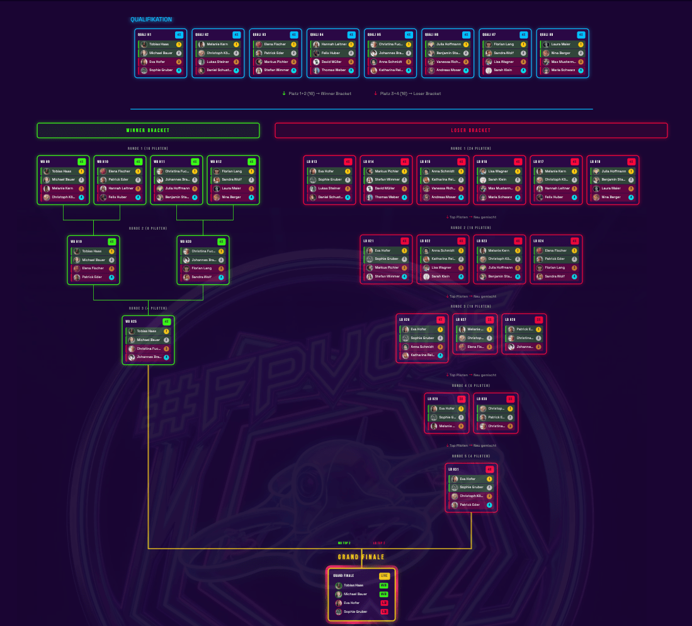
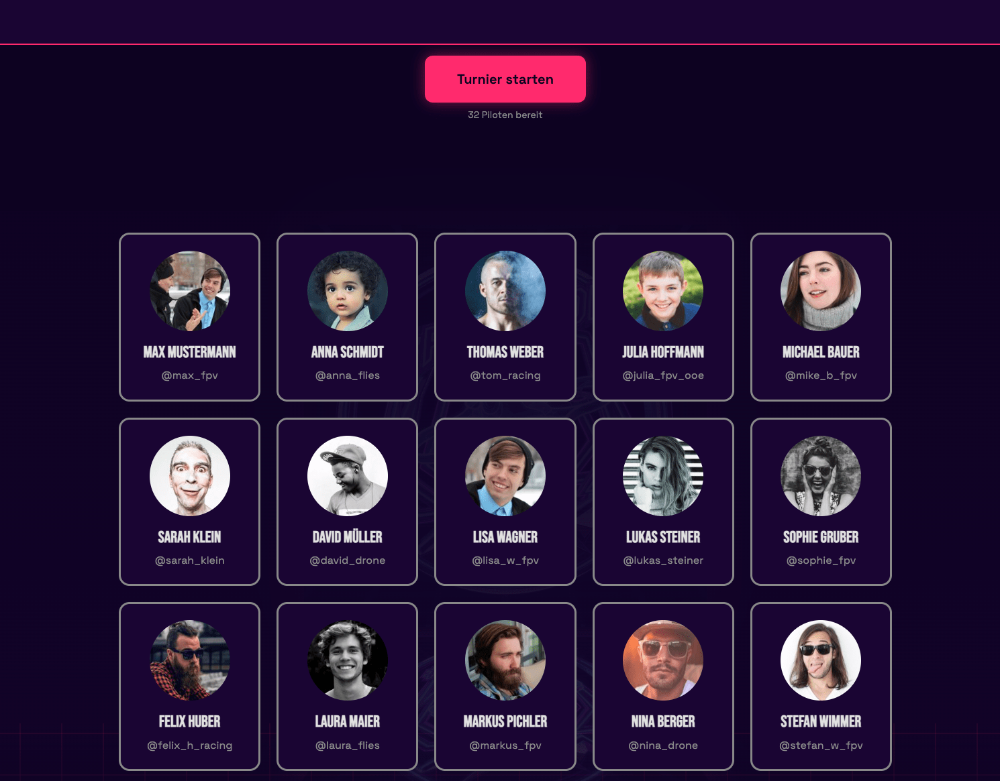
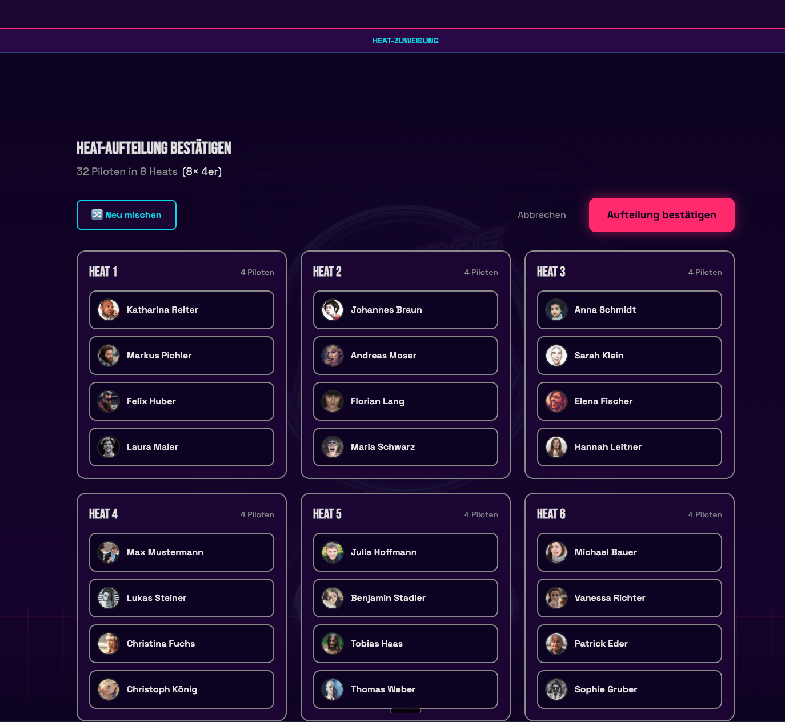
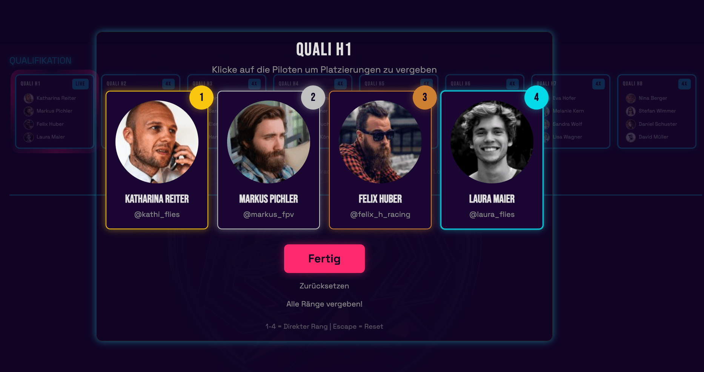
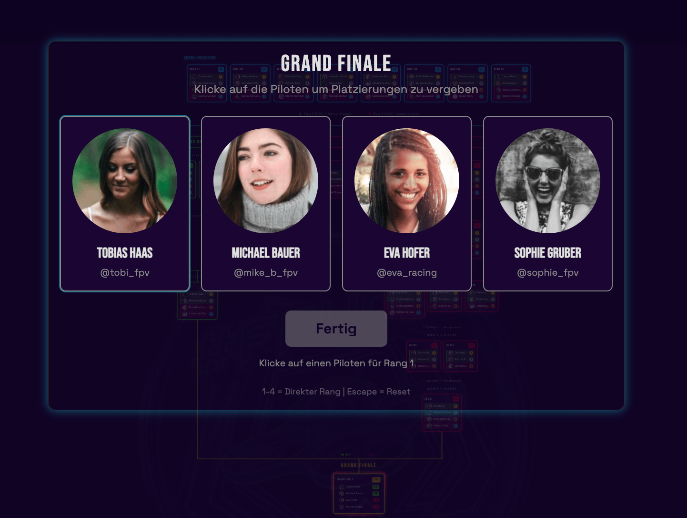
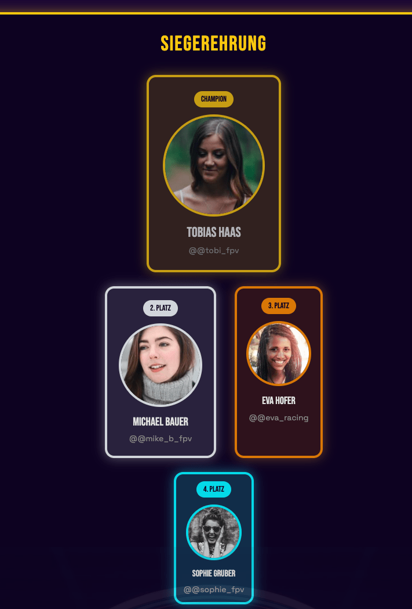

# FPV Racing Heats

**Turnierverwaltung für FPV-Drohnenrennen mit Double-Elimination-Bracket**

Eine spezialisierte Web-App zur Durchführung von FPV-Drohnenrennen-Turnieren, entwickelt für die FPVOOE (FPV Austria/OOE) Racing Community. Optimiert für Beamer-Präsentation bei Live-Events mit Synthwave-Design und animierten visuellen Effekten.



---

## Schnellstart

### Voraussetzungen

- Node.js 18+
- npm oder yarn

### Installation & Start

```bash
# Repository klonen
git clone <repository-url>
cd heats

# Abhängigkeiten installieren
npm install

# Entwicklungsserver starten
npm run dev
```

Die App läuft unter `http://localhost:5173`

### Als App installieren (PWA)

Die App kann auf mobilen Geräten als Progressive Web App (PWA) installiert werden. Dadurch läuft sie im **Vollbildmodus** ohne Browser-UI (keine Adressleiste, keine Tabs).

#### iOS (iPhone/iPad)

1. Öffne die App in **Safari** (nicht Chrome - iOS Chrome unterstützt keine PWA-Installation)
2. Tippe auf das **Teilen-Symbol** (Quadrat mit Pfeil nach oben)
3. Scrolle nach unten und wähle **"Zum Home-Bildschirm"**
4. Bestätige mit **"Hinzufügen"**

Die App erscheint nun als Icon auf dem Home-Bildschirm und öffnet sich immer im Vollbildmodus.

#### Android (Chrome)

1. Öffne die App in **Chrome**
2. Tippe auf das **3-Punkte-Menü** (oben rechts)
3. Wähle **"App installieren"** oder **"Zum Startbildschirm hinzufügen"**
4. Bestätige die Installation

Die App wird installiert und kann wie eine native App gestartet werden.

#### Vorteile der PWA-Installation

- **Vollbildmodus** - Keine Browser-UI, mehr Platz für das Bracket
- **Schneller Start** - Direkter Zugriff vom Home-Bildschirm
- **Offline-fähig** - Grundfunktionen auch ohne Internet verfügbar
- **App-Erlebnis** - Fühlt sich wie eine native App an

### NPM Scripts

| Script | Beschreibung |
|--------|--------------|
| `npm run dev` | Startet Entwicklungsserver (Port 5173) |
| `npm run build` | Erstellt Production Build |
| `npm run preview` | Vorschau des Production Builds |
| `npm test` | Startet Tests im Watch-Mode |
| `npm run test:ui` | Tests mit UI-Oberfläche |
| `npm run lint` | Code-Qualitätsprüfung |

---

## Features im Überblick

### 1. Pilotenverwaltung

Die App unterstützt **7 bis 60 Piloten** pro Turnier.

#### Manuelles Hinzufügen

- **Name** (mindestens 3 Zeichen, Pflicht)
- **Bild-URL** (Pflicht) - für die Anzeige im Bracket
- **Instagram-Handle** (optional) - wird automatisch mit @ versehen

#### CSV-Import

Für größere Turniere können Piloten per CSV-Datei importiert werden:

- **Drag & Drop** oder Dateiauswahl
- **Vorlage herunterladen** direkt in der App verfügbar
- **Automatische Validierung** der Daten

**CSV-Format:**
```csv
Name,Bild-URL,Instagram
Max Mustermann,https://example.com/foto.jpg,@maxfpv
Lisa Racer,https://example.com/lisa.jpg,
```

Unterstützte Spalten: `Name`, `Bild-URL` (oder `imageUrl`), `Instagram` (optional)

#### Weitere Funktionen

- **Bearbeiten** - Name, Bild-URL und Instagram nachträglich ändern
- **Löschen** - Piloten vor Turnierstart entfernen
- **Duplikaterkennung** - Warnung bei doppelten Namen (case-insensitive)
- **Ausgeschieden markieren** - Piloten während des Turniers als "dropped out" markieren



---

### 2. Automatische Heat-Aufteilung

Die App berechnet automatisch die optimale Verteilung der Piloten auf **3er- und 4er-Heats**.

#### Algorithmus

- Maximiert die Anzahl der 4er-Heats (effizienter)
- Füllt mit 3er-Heats auf
- Keine 1er- oder 2er-Heats möglich
- Für 7-60 Piloten immer eine gültige Lösung garantiert

**Beispiele:**
| Piloten | 4er-Heats | 3er-Heats | Gesamt |
|---------|-----------|-----------|--------|
| 8 | 2 | 0 | 2 Heats |
| 10 | 1 | 2 | 3 Heats |
| 16 | 4 | 0 | 4 Heats |
| 32 | 8 | 0 | 8 Heats |

#### Flexible Anpassung

In der **Heat-Zuweisung** vor Turnierstart:

- **Drag & Drop** - Piloten zwischen Heats verschieben
- **Shuffle-Funktion** - Piloten zufällig neu verteilen
- **Validierung** - Warnung bei zu vollen (>4) oder leeren Heats



---

### 3. Double-Elimination-Bracket

Das Turnier folgt dem **Double-Elimination**-System:

```
Qualification → Winner Bracket → Grand Finale
                    ↓                ↑
              Loser Bracket ─────────┘
```

#### Qualification Phase

- Alle Piloten starten in den Quali-Heats
- **Platz 1-2** → Winner Bracket (WB)
- **Platz 3-4** → Loser Bracket (LB)

#### Winner Bracket (WB)

- Gewinner bleiben im Winner Bracket
- **Platz 1-2** → weiter im WB
- **Platz 3-4** → fallen ins Loser Bracket

#### Loser Bracket (LB)

- Zweite Chance für alle
- **Platz 1-2** → weiter im LB
- **Platz 3-4** → endgültig eliminiert

#### Synchronisation

Das Loser Bracket wartet auf die entsprechenden Winner Bracket Runden, damit keine unfairen Vorteile entstehen.

#### Grand Finale

- **WB Top 2** + **LB Top 2** = 4 Finalisten

---

### 4. Turnier durchführen

#### Phase 1: Setup (Piloten hinzufügen)

1. Piloten manuell hinzufügen oder CSV importieren
2. Mindestens 7, maximal 60 Piloten erforderlich
3. Button "Turnier starten" erscheint bei gültiger Anzahl

#### Phase 2: Heat-Zuweisung bestätigen

1. Automatische Heat-Aufteilung wird angezeigt
2. Optional: Piloten per Drag & Drop umverteilen
3. Optional: "Shuffle" für zufällige Neuverteilung
4. "Aufteilung bestätigen" startet das Turnier

#### Phase 3: Heats durchführen

1. **Aktiver Heat** wird im Bracket hervorgehoben (animierter Rahmen)
2. **Klick auf Heat** öffnet das Platzierungs-Modal
3. **Platzierungen eingeben**: Piloten anklicken (1. Klick = 1. Platz, etc.)
4. **Ergebnisse speichern** - nächster Heat wird automatisch aktiviert
5. **On-Deck-Vorschau** zeigt den nächsten Heat

#### Platzierungseingabe

- **Click-to-Rank**: Einfach Piloten in Reihenfolge anklicken
- **Tastaturkürzel**: Ziffern 1-4 für schnelle Eingabe
- Alle Piloten müssen eine eindeutige Platzierung haben
- Keine doppelten Platzierungen erlaubt

##### Rundenzeiten erfassen (optional)

Für Turniere mit Zeitnehmung können zusätzlich **Rundenzeiten** pro Pilot erfasst werden:

1. **Platzierung eingeben** - Pilot anklicken oder Taste 1-4 drücken
2. **Zeit eingeben** - Nach Vergabe der Platzierung Ziffern tippen (z.B. `123` für 1:23)
3. **Bestätigen** - Enter drücken oder nächsten Piloten platzieren

**Zeitformat:**
- 1-2 Ziffern: Sekunden (z.B. `5` → 0:05, `45` → 0:45)
- 3-4 Ziffern: Minuten:Sekunden (z.B. `123` → 1:23, `959` → 9:59)
- Bereich: 0:01 bis 9:59

Die erfassten Zeiten werden im Bracket neben der Platzierung angezeigt und sind im CSV-Export enthalten.



#### Phase 4: Grand Finale

- Automatisch generiert wenn WB und LB abgeschlossen sind
- 4 Finalisten kämpfen um den Sieg



#### Phase 5: Siegerehrung

- **Podium-Anzeige** mit Top 4 Piloten
- Gold/Silber/Bronze/Cyan Styling mit Animationen
- **"Neues Turnier"** Button zum Zurücksetzen



---

### 5. Bracket-Visualisierung

#### Interaktive Navigation

- **Zoom** mit Mausrad oder Touchpad
- **Pan** durch Ziehen mit der Maus
- **Zoom-Indicator** zeigt aktuelle Zoomstufe
- **Doppelklick** setzt Zoom zurück

#### Farbcodierung

| Farbe | Bedeutung |
|-------|-----------|
| Cyan | Qualification Heats |
| Grün | Winner Bracket |
| Rot | Loser Bracket |
| Gold | Grand Finale |

#### Status-Anzeige

- **Ausstehend** - Heat wartet auf Vorgänger
- **Aktiv** - Animierter Rahmen, bereit zur Eingabe
- **Abgeschlossen** - Ergebnisse anzeigen durch Klick

#### Heat-Details

Klick auf abgeschlossene Heats zeigt:
- Alle Piloten mit finaler Platzierung
- Wohin jeder Pilot weitergeleitet wurde (WB/LB/Eliminiert)

---

### 6. Daten-Persistenz

- **Automatische Speicherung** in localStorage
- Turnier-Fortschritt bleibt bei Browser-Neustart erhalten
- Pilotenliste bleibt auch nach Turnierende gespeichert
- **"Neues Turnier"** behält Piloten, setzt nur Bracket zurück

---

### 7. Export & Import

Die App bietet Export- und Import-Funktionen im Footer-Bereich.

#### Export-Optionen

| Format | Inhalt | Anwendungsfall |
|--------|--------|----------------|
| **JSON** | Kompletter Turnier-State | Backup, Turnier-Wiederherstellung |
| **CSV** | Piloten + Ergebnisse | Dokumentation, Weitergabe |

- **JSON-Export** speichert alle Daten (Piloten, Heats, Bracket-Status)
- **CSV-Export** erzeugt eine lesbare Tabelle mit Piloten, Platzierungen und Rundenzeiten (falls erfasst)
- In der **Siegerehrung** wird automatisch ein CSV-Export angeboten

#### Import

- **JSON-Import** stellt einen zuvor exportierten Turnier-Stand wieder her
- Bestätigungsdialog zeigt Piloten-/Heat-Anzahl vor dem Import
- Import überschreibt alle aktuellen Daten

**Typischer Workflow:**
1. Vor Event: JSON-Backup erstellen
2. Bei Problemen: JSON-Import zur Wiederherstellung
3. Nach Event: CSV-Export für Ergebnisliste

---

## Tastenkürzel

| Kürzel | Aktion |
|--------|--------|
| `Scroll` | Zoom im Bracket |
| `Drag` | Pan im Bracket |
| `Doppelklick` | Zoom zurücksetzen |
| `1-4` | Schnelle Platzierungseingabe |
| `Escape` | Modal schließen |

---

## Technischer Überblick

### Tech-Stack

- **Frontend**: React 18 + TypeScript
- **Build**: Vite
- **Styling**: Tailwind CSS (Synthwave Theme)
- **State**: Zustand mit localStorage-Persistenz
- **Forms**: React Hook Form + Zod Validierung
- **Drag & Drop**: @dnd-kit
- **CSV**: PapaParse
- **Icons**: Lucide React

### Projektstruktur

```
heats/
├── src/
│   ├── components/        # React-Komponenten
│   │   ├── bracket/       # Bracket-Visualisierung
│   │   └── ui/            # Wiederverwendbare UI-Elemente
│   ├── stores/            # Zustand State Management
│   ├── lib/               # Business-Logik & Utilities
│   ├── hooks/             # Custom React Hooks
│   ├── types/             # TypeScript-Definitionen
│   └── App.tsx            # Haupt-Komponente
├── tests/                 # Test-Dateien & Fixtures
├── docs/                  # Dokumentation
└── public/                # Statische Assets
```

---

## Troubleshooting

### Daten werden nicht gespeichert

- Prüfen ob localStorage verfügbar ist (Private Mode kann blockieren)
- Browser-Console auf Fehler prüfen (F12 → Console)

### Bracket zeigt keine Heats

- Turnier muss gestartet sein ("Aufteilung bestätigen")
- Prüfen ob 7-60 Piloten registriert sind

### Heat-Ergebnisse werden nicht übernommen

- Alle Piloten im Heat müssen eine Platzierung haben
- Keine doppelten Platzierungen erlaubt
- Button "Ergebnisse speichern" klicken

### Piloten können nicht hinzugefügt werden

- Maximale Anzahl (60) erreicht?
- Name mindestens 3 Zeichen?
- Gültige Bild-URL eingegeben?

---

## Weiterführende Dokumentation

| Dokument | Inhalt |
|----------|--------|
| [Getting Started](./getting-started.md) | Detaillierte Installationsanleitung |
| [Architektur](./architecture.md) | Technische Architektur-Entscheidungen |
| [Architecture Deep-Dive](./architecture-deep-dive.md) | Vertiefende technische Details |
| [Tech-Stack](./tech-stack.md) | Verwendete Technologien |
| [Source Tree](./source-tree.md) | Vollständige Verzeichnisstruktur |
| [PRD](./prd.md) | Product Requirements Document |
| [Store API](./store-api.md) | Zustand Store Dokumentation |

---

## Lizenz

Entwickelt für FPVOOE - FPV Austria Racing Community

---

*Zuletzt aktualisiert: 2026-01-27*
