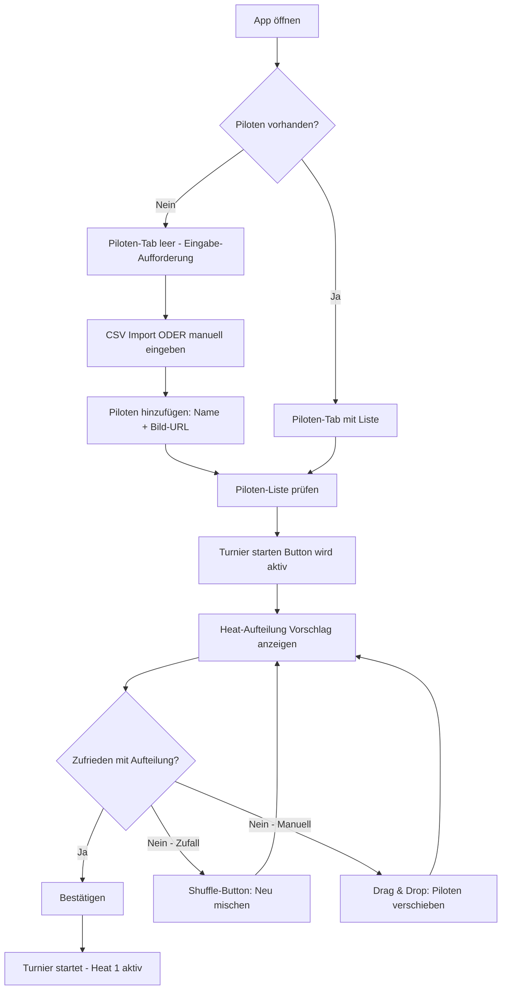
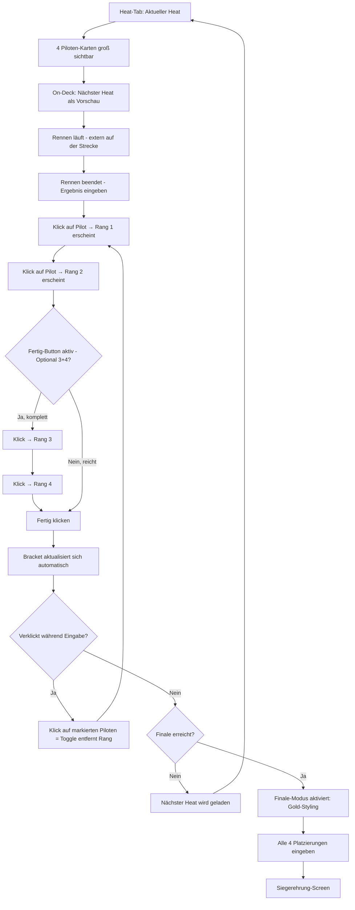
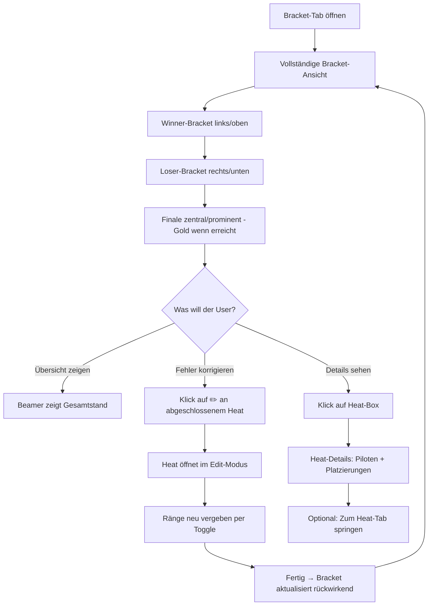
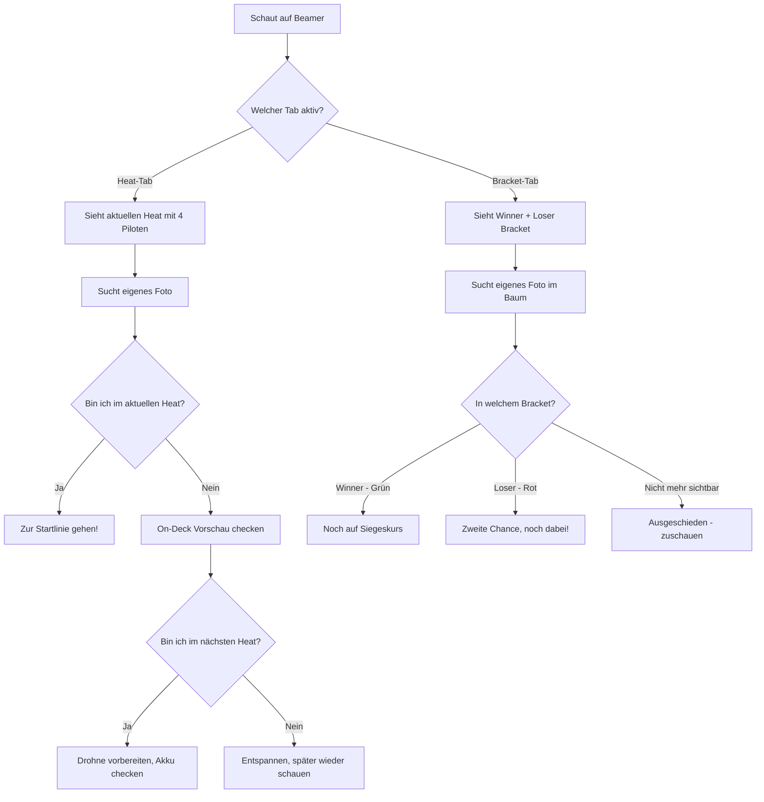
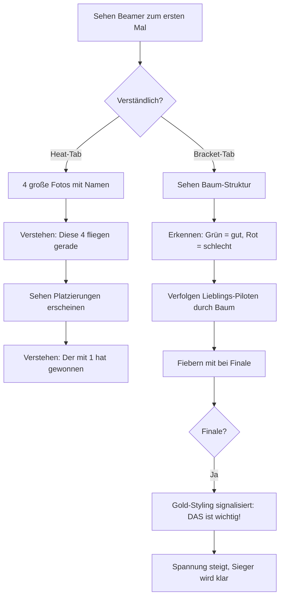

# UX Design Specification FPV Racing Heats

**Author:** Jakob
**Date:** 2025-12-12

---

## Executive Summary

### Project Vision

**FPV Racing Heats** ist eine browserbasierte Turnier-App für FPV-Drohnenrennen im Double-Elimination-Format. Die App ersetzt Zettelwirtschaft und Excel-Chaos durch eine intuitive "digitale Magnettafel" – Piloten anklicken, Gewinner markieren, Bracket füllt sich automatisch.

**Design-Philosophie:** Zero Einarbeitung. Wenn Thomas die App zum ersten Mal öffnet, soll er innerhalb von 30 Sekunden das erste Ergebnis eingetragen haben.

### Target Users

| User | Kontext | Kernbedürfnis | Erfolgsmoment |
|------|---------|---------------|---------------|
| **Organisator (Thomas)** | Laptop am Streckenrand, Beamer angeschlossen, 20-35 Piloten | Turnier entspannt durchführen, keine Fragen beantworten | "Das war der entspannteste Turniertag seit Jahren" |
| **Pilot (Lisa)** | Schaut auf Beamer, kein App-Zugriff, oft erstes Turnier | Wissen wann sie dran ist, verstehen wo sie im Bracket steht | "Ich hab den ganzen Tag niemanden fragen müssen" |
| **Zuschauer (Familie Huber)** | Zufällig da, keine FPV-Kenntnisse, schaut auf Beamer | Verstehen was passiert, mitfiebern können | "Das ist ja spannender als Fußball!" |

### Visual Design Direction

**Ästhetik:** Synthwave / Retrowave – 80er Jahre Neon-Ästhetik mit modernem Touch.

| Element | Beschreibung |
|---------|--------------|
| **Farbwelt** | Tiefes Violett bis Magenta als Basis, Neon-Pink und Cyan als Akzente, Gold für Sieger/Highlights |
| **Atmosphäre** | Nächtliche Cyberpunk-Landschaft, leuchtende Grid-Linien am Horizont |
| **Piloten-Darstellung** | Fotos in Neon-Rahmen mit Glow-Effekt |
| **Tonalität** | Locker, nicht zu ernst – Retro-Trash mit Augenzwinkern |

**Referenz-Stimmung:** Tron meets Outrun – futuristisch, aber mit nostalgischem 80er-Charme. Darf "cheesy" sein.

### Key Design Challenges

1. **10-Meter-Lesbarkeit:** Alles muss auf Beamer-Projektion aus 10m Entfernung funktionieren. Große Schrift, hoher Kontrast, keine Hover-States.

2. **Drei Nutzer, ein Screen:** Organisator tippt, Piloten und Zuschauer schauen zu. Admin-Buttons sichtbar, aber Visualisierung für alle verständlich.

3. **Null Einarbeitung:** Offensichtliche Interaktionen, kein Tutorial, sofort loslegen.

4. **"Bin ich noch drin?"-Klarheit:** Farbcodierung und sichtbare Historie müssen Panzerklarheit schaffen.

### Design Opportunities

1. **Emotionales Bracket:** Nicht nur Daten, sondern Geschichten erzählen. Der Comeback-Pfad im Loser-Bracket soll sichtbar und spannend sein.

2. **On-Deck Vorschau:** Nächster Heat als Vorschau reduziert Stress und verhindert verpasste Einsätze.

3. **Synthwave-Ästhetik als Differentiator:** Kein generisches Tool – eigene visuelle Identität die zur FPV-Community passt.

### Interaction Patterns

**Ergebnis-Eingabe (Toggle-to-Rank Pattern):**

- Klick auf unmarkierten Pilot → Nächste Platzierungszahl erscheint (1, 2, 3, 4)
- Klick auf markierten Pilot → Zahl wird entfernt (Toggle-Verhalten für Korrektur)
- **Minimum:** 2 Piloten (Platz 1 + 2) – "Fertig"-Button wird aktiv
- **Optional:** Platz 3 + 4 können zusätzlich vergeben werden für vollständige Heat-Historie
- **Fertig-Button** → Heat abschließen (aktiv ab 2 ausgewählten Piloten)
- **Edit-Button [✏️]** → An abgeschlossenen Heats für nachträgliche Korrektur

**Flexibilität by Design:** Die meisten Organisatoren werden alle 4 Plätze vergeben um die komplette Rangliste zu sehen. Aber wenn's schnell gehen muss, reichen 2 Klicks + Fertig. Kein separater Reset-Button nötig – Klick auf markierten Piloten entfernt die Zahl.

## Core User Experience

### Defining Experience

**Core Action:** Ergebnis-Eingabe nach jedem Heat – der Loop der sich 15-30x pro Turnier wiederholt.

**Interaktions-Rhythmus:**
```
Heat läuft → Rennen fertig → Platzierungen vergeben → Fertig → Nächster Heat
```

Wenn dieser Loop mühelos ist, ist das Turnier entspannt. Alles andere ist sekundär.

### Platform Strategy

| Aspekt | Entscheidung |
|--------|--------------|
| **Typ** | Web-App (SPA) |
| **Input-Gerät** | Laptop mit Maus/Keyboard |
| **Output** | Beamer-Projektion (1920x1080) |
| **Offline** | Vollständig offline-fähig (localStorage) |
| **Audio** | Keine Sound-Ausgabe (Event-Umgebung) |

### Effortless Interactions

**Was mühelos sein muss:**

1. **Piloten erkennen** – Große Fotos auf dem Heat-Screen, sofort identifizierbar
2. **Platzierung vergeben** – Klick auf Foto ODER Tastatur (1/2/3/4)
3. **Heat abschließen** – Ein Klick auf "Fertig", keine Confirmation
4. **Fehler korrigieren** – Kleiner Stift-Button [✏️] an abgeschlossenen Heats

**Input-Optionen:**
- **Maus:** Klick auf Piloten-Foto vergibt nächste Platzierung
- **Tastatur:** Tasten 1-4 vergeben Platzierung an fokussierten/nächsten Piloten

### Critical Success Moments

**Der "Es funktioniert!"-Moment:**
Nach dem ersten abgeschlossenen Heat sieht Thomas: Das Bracket hat sich automatisch aktualisiert, die Piloten sind an der richtigen Stelle. Keine manuelle Zuordnung, keine Fehler.

**Der "Puh, gerettet"-Moment:**
Thomas merkt nach Heat 7, dass er bei Heat 3 einen Fehler gemacht hat. Kleiner Stift-Button → Heat bearbeiten → Korrigieren → Bracket aktualisiert sich rückwirkend.

### Experience Principles

1. **Minimum Viable Interaction:** 2 Klicks + Fertig. Keine extra Confirmations, keine unnötigen Schritte.

2. **Fehlertoleranz statt Fehlervermeidung:** Keine nervigen "Sind Sie sicher?"-Dialoge. Stattdessen jederzeit korrigierbar.

3. **User in Control:** Kein automatischer Tab-Wechsel, keine Bevormundung. Thomas entscheidet wann er wohin navigiert.

4. **Input-Flexibilität:** Maus UND Tastatur. Thomas wählt was in der Situation passt.

## Desired Emotional Response

### Primary Emotional Goals

| User | Gewünschte Emotion | Auslöser |
|------|-------------------|----------|
| **Thomas (Orga)** | Entspannt & in Kontrolle | Mühelose Interaktion, sofortiges Feedback |
| **Lisa (Pilotin)** | Orientiert & selbstbewusst | Klare Farbcodierung, eigenes Foto sofort erkennbar |
| **Familie Huber** | Fasziniert & mitfiebernd | Verständliche Visualisierung, spannende Bracket-Darstellung |

**Übergreifende Emotion:** Spielfreude. Die App soll sich anfühlen wie ein Arcade-Game aus den 80ern – nicht wie ein Business-Tool.

### Emotional Journey Mapping

| Moment | Emotion | Design-Ausdruck |
|--------|---------|-----------------|
| **App öffnen** | "Hey, das ist cool!" | Synthwave-Ästhetik, Neon-Glow, einladend |
| **Erster Heat fertig** | "Boom, das war easy!" | Sofortiges Bracket-Update, visuelles Erfolgsfeedback |
| **Fehler gemacht** | "Kein Stress, kann ich fixen" | Toggle zum Entfernen, Stift-Button für abgeschlossene Heats |
| **Im Loser-Bracket** | "Noch nicht vorbei!" | Grün = noch dabei, Comeback-Pfad sichtbar |
| **Finale** | "Das ist episch!" | Verstärkte Effekte, Gold-Akzente, Pulsieren |

### Micro-Emotions

**Zu verstärken:**
- ✅ Spielfreude (Retro-Gaming-Nostalgie)
- ✅ Kontrolle (alles reagiert sofort)
- ✅ Zugehörigkeit (FPV OÖ Branding, Community-Gefühl)
- ✅ Spannung (pulsierend, dynamisch)

**Zu vermeiden:**
- ❌ Überforderung (zu viele Optionen)
- ❌ Unsicherheit ("Hat das funktioniert?")
- ❌ Langeweile (statisch, steril)
- ❌ Ernsthaftigkeit (Business-Tool-Feeling)

### Design Implications

| Emotion | UX-Umsetzung |
|---------|--------------|
| **Spielfreude** | Synthwave-Ästhetik, darf "cheesy" sein, leicht übertriebene Effekte |
| **Energie** | Subtiles Pulsieren bei Neon-Elementen, dynamische Akzente |
| **Triumph (Finale)** | Gold-Farbakzente, verstärktes Pulsieren, episches Gefühl |
| **Klarheit** | Farbcodierung (Grün/Rot), große Piloten-Fotos, sofortiges Feedback |
| **Gelassenheit** | Fehler jederzeit korrigierbar, kein "Sind Sie sicher?"-Stress |

### Emotional Design Principles

1. **Arcade over Enterprise:** Jede Design-Entscheidung fragt: "Fühlt sich das an wie ein cooles Arcade-Game oder wie eine Büro-Software?" Immer Arcade wählen.

2. **Pulsierend, nicht statisch:** Subtile Animationen, Glow-Effekte die atmen, lebendige UI. Aber nicht ablenkend – unterstützend.

3. **Finale = Klimax:** Das Turnier baut auf etwas hin. Das Finale soll sich visuell abheben – mehr Gold, mehr Pulsieren, mehr "Das ist der Moment!".

4. **Retro-Trash mit Herz:** Darf kitschig sein, darf übertrieben sein. Das ist Teil des Charmes. Nicht ironisch-distanziert, sondern liebevoll-nostalgisch.

## UX Pattern Analysis & Inspiration

### Inspiring Products Analysis

**Visuelle Referenz: Stranger Things**

Die Netflix-Serie dient als primäre visuelle Inspiration – nicht für UX-Patterns, aber für die Ästhetik:

| Element | Referenz | Adaption |
|---------|----------|----------|
| **Logo-Stil** | Rote Neon-Buchstaben, leichtes Flackern | Titel mit Neon-Glow-Effekt |
| **Farbwelt** | Rot, dunkles Blau, warm | Pink/Magenta + Cyan + Violett |
| **Typografie** | ITC Benguiat (Retro-Serif) | Retro-inspirierte Schrift mit Glow |
| **Atmosphäre** | 80er-Nostalgie, mysteriös-warm | 80er-Nostalgie, energetisch-warm |

**Weitere Inspirationsquellen (UX-Patterns):**

- **Sport-Broadcast-UI:** Große Lesbarkeit, klare "wer führt?"-Hierarchie, Foto-Fokus
- **Arcade-Games:** Sofortiges visuelles Feedback, pulsierendes UI, Belohnungsgefühl
- **Bracket-Tools (Challonge etc.):** Automatische Progression – aber OHNE deren Komplexität

### Transferable UX Patterns

**Navigation: Tab-Bar**
- 3 klare Tabs: Piloten | Bracket | Aktueller Heat
- Immer sichtbar, keine versteckten Menüs
- Große Touch-Targets, aktiver Tab klar hervorgehoben

**Ergebnis-Eingabe: Click-to-Rank**
- Piloten-Fotos als große klickbare Karten
- Klick vergibt nächste Platzierung, Zahl erscheint auf Foto
- Neon-Rahmen leuchtet bei Auswahl auf

**Bracket: Flowing Tree**
- Verbindungslinien zwischen Heats und Runden
- Farbcodierte Pfade: Grün = Winner, Rot = Loser, Gold = Finale
- Piloten-Historie sichtbar (bleiben wo sie waren)

**Feedback: Instant Glow**
- Jede Aktion hat sofortiges visuelles Feedback
- Klick → kurzer Glow-Pulse
- Heat abgeschlossen → Bracket "leuchtet auf" während Update

### Anti-Patterns to Avoid

| Anti-Pattern | Problem | Stattdessen |
|--------------|---------|-------------|
| **Dropdown-Menüs** | Verstecken Optionen, nicht Beamer-tauglich | Alles sichtbar in Tabs |
| **Kleine Icons ohne Text** | Nicht 10m-lesbar | Große Icons MIT Text |
| **Modale Dialoge** | Unterbrechen Flow | Inline-Aktionen, Edit-Button |
| **Hover-States** | Auf Beamer unsichtbar | Alles immer sichtbar |
| **Confirmation Dialogs** | Nerven, verlangsamen | Fehler korrigierbar statt verhindern |
| **Business-Grau** | Kein Synthwave-Feeling | Neon auf Dunkel |

### Design Inspiration Strategy

**Adopt (Übernehmen):**
- Tab-Navigation – bewährt, einfach, Beamer-tauglich
- Click-to-Rank – intuitiv, visuell, schnell
- Instant Feedback – Arcade-Gefühl, Kontrolle

**Adapt (Anpassen):**
- Bracket-Visualisierung – von Sport-Broadcast, aber mit Neon-Ästhetik
- Stranger Things Farbwelt – von Rot zu Pink/Cyan für mehr Energie

**Avoid (Vermeiden):**
- Komplexität von Challonge & Co – zu viele Features
- Business-Software-Feeling – zu steril, zu ernst
- Versteckte Interaktionen – alles muss offensichtlich sein

## Design System Foundation

### Design System Choice

**Gewählt: Tailwind CSS**

Tailwind CSS als Utility-First CSS-Framework bietet die ideale Balance für FPV Racing Heats:
- Volle Kontrolle über die Synthwave-Ästhetik
- Schnelle Entwicklung ohne CSS-Dateien
- Keine fremde visuelle Sprache (kein "Bootstrap-Look")
- Einfache Umsetzung von Glow-Effekten und Custom-Farben

**Komponenten-Bibliothek:** Offen gelassen für Architektur-Entscheidung (z.B. shadcn/ui für React, oder reine Tailwind-Komponenten).

### Rationale for Selection

| Anforderung | Warum Tailwind |
|-------------|----------------|
| **Synthwave-Look** | Eigene Farbpalette definierbar, keine Design-System-Vorgaben |
| **Neon-Glow-Effekte** | Mit `shadow-*` und Custom-Utilities umsetzbar |
| **Beamer-Lesbarkeit** | Eigene Breakpoints für große Schrift definierbar |
| **Schnelle Entwicklung** | Utility-First = weniger Context-Switching |
| **Keine Abhängigkeit** | Kein Vendor-Lock-in, kein fremdes Design |

### Implementation Approach

**Tailwind-Konfiguration für Synthwave:**

```javascript
// Konzeptuelle Farbpalette (exakte Werte vom Designer)
colors: {
  // Basis
  'void': '#0d0221',           // Tiefes Violett-Schwarz
  'night': '#1a0533',          // Dunkles Violett
  
  // Primär
  'neon-pink': '#ff2a6d',      // Heißes Pink
  'neon-cyan': '#05d9e8',      // Leuchtendes Cyan
  'neon-magenta': '#d300c5',   // Magenta
  
  // Akzente
  'gold': '#f9c80e',           // Sieger-Gold
  'winner-green': '#39ff14',   // Neon-Grün für Winner
  'loser-red': '#ff073a',      // Neon-Rot für Loser
  
  // Graustufen (für Text)
  'chrome': '#e0e0e0',         // Heller Text
  'steel': '#888888',          // Gedämpfter Text
}
```

**Custom Utilities für Glow:**
- `glow-pink`, `glow-cyan`, `glow-gold` für Neon-Rahmen
- `pulse-slow` für subtiles Pulsieren
- `text-glow` für leuchtenden Text

### Customization Strategy

**Was angepasst wird:**
- Farbpalette → Synthwave-Farben
- Box-Shadows → Glow-Effekte
- Font-Sizes → Beamer-taugliche Größen (min. 24px für Body)
- Breakpoints → Desktop-fokussiert (1920x1080)

**Was Standard bleibt:**
- Spacing-System (Tailwind-Defaults sind gut)
- Flexbox/Grid-Utilities
- Transitions/Animations-Grundlagen

**Komponenten-Strategie:**
Ob shadcn/ui, Headless UI, oder Custom – die Tailwind-Basis erlaubt alle Optionen. Der Architekt entscheidet basierend auf Framework-Wahl (React/Vue/Svelte).

## Defining Experience

### The Core Interaction

> **"Klick auf die Gewinner und das Bracket füllt sich von selbst"**

Das ist der Moment, der FPV Racing Heats definiert. Thomas klickt auf Anna (1.), auf Ben (2.), drückt Fertig – und das Bracket aktualisiert sich automatisch. Die Piloten erscheinen an der richtigen Stelle, der nächste Heat ist bereit. Magie.

### User Mental Model

**Wie Thomas es heute macht:**
- Whiteboard mit Magneten / Zettel
- Excel-Tabelle, manuell updaten
- Ständig rechnen: "Wer muss jetzt wohin?"

**Was er von der App erwartet:**
- "Digitale Magnettafel" – die Kern-Metapher
- Piloten-Fotos die er durch Klicks "bewegt"
- Automatische Logik die er nicht verstehen muss

**Wo er NICHT verwirrt sein darf:**
- Double Elimination ist komplex – aber die App versteckt die Komplexität
- Thomas muss nur wissen: "Wer ist 1. und 2.?" – den Rest macht die App

### Success Criteria

| Kriterium | Messung |
|-----------|---------|
| **Zeit pro Heat** | < 10 Sekunden (2 Klicks + Fertig) |
| **Fehlerkorrektur** | Toggle zum Entfernen (vor Fertig), Edit-Button (nach Fertig) |
| **Verständnis** | Thomas versteht NICHT wie Double Elimination funktioniert – und braucht es nicht |
| **Feedback** | Sofort sichtbar dass Bracket sich aktualisiert hat |
| **Vertrauen** | Nach Heat 1 weiß Thomas: "Das funktioniert" |

### Experience Mechanics

**1. Initiation – Wie startet Thomas?**
```
Heat-Tab zeigt: "HEAT 5" mit 4 Piloten-Fotos
→ Thomas weiß: Das Rennen ist vorbei, jetzt Ergebnis eintragen
```

**2. Interaction – Was macht er?**
```
Klick auf Anna (leer) → "1" erscheint (Neon-Glow)
Klick auf Ben (leer) → "2" erscheint
Oops, verklickt?
Klick auf Anna ("1") → Zahl verschwindet, Ben wird zu "1"
Klick auf Chris (leer) → "2" erscheint
(Optional: weiter bis "4")
```

**3. Feedback – Was sieht er?**
```
- Sofortiger Glow bei jedem Klick
- Zahl erscheint instant auf dem Foto
- "Fertig"-Button leuchtet auf sobald 2 gewählt sind
- Nochmal-Klick auf markierten Piloten = Zahl weg (kein Reset-Button nötig)
```

**4. Completion – Was passiert bei "Fertig"?**
```
→ Kurzer visueller "Success"-Pulse
→ Bracket aktualisiert sich (Piloten erscheinen an neuen Positionen)
→ Nächster Heat wird geladen
→ On-Deck zeigt: "Nächster Heat: Erik, Flo, Gina, Hans"
```

### Novel UX Patterns

**Established (bewährt):**
- Klick-to-Select → jeder kennt das
- Tab-Navigation → Standard
- Große Foto-Karten → Instagram/Kontakte-App

**Novel (unser Twist):**
- **Toggle-to-Rank:** Klick vergibt Zahl, nochmal Klick entfernt sie → eliminiert Reset-Button
- **Automatische Bracket-Progression:** "Magie" statt manuelles Verschieben
- **Cycle-Vergabe (1→2→3→4):** Effizienter als separate Buttons pro Platz

### Error Handling Strategy

| Fehlertyp | Lösung |
|-----------|--------|
| **Verklickt während Eingabe** | Klick auf markierten Piloten → Zahl entfernen |
| **Falscher Pilot gewählt** | Toggle + neu vergeben |
| **Fehler nach "Fertig"** | Edit-Button [✏️] am Heat → Heat wieder öffnen |
| **Fehler Heats später bemerkt** | Edit-Button funktioniert auch rückwirkend |

**Kein Reset-Button, kein Confirmation-Dialog.** Stattdessen: Toggle-Verhalten + nachträgliche Edit-Möglichkeit. Minimum UI, maximum Flexibilität.

## Visual Design Foundation

### Color System

**Philosophie:** Synthwave-Ästhetik mit dunklem Grund und leuchtenden Neon-Akzenten. Die Farben sollen "glühen", aber nicht blenden.

#### Farbpalette

| Rolle | Name | Hex | Verwendung |
|-------|------|-----|------------|
| **Background** | Void | `#0d0221` | Haupt-Hintergrund, tiefes Violett-Schwarz |
| **Surface** | Night | `#1a0533` | Karten, erhöhte Flächen, Tabs |
| **Primary** | Neon-Pink | `#ff2a6d` | CTAs, aktive Elemente, Haupt-Akzent |
| **Secondary** | Neon-Cyan | `#05d9e8` | Sekundäre Akzente, Links, Info |
| **Accent** | Magenta | `#d300c5` | Highlights, Glow-Effekte |
| **Winner** | Neon-Grün | `#39ff14` | Winner-Bracket, "noch dabei" |
| **Loser** | Neon-Rot | `#ff073a` | Loser-Bracket, "ausgeschieden" |
| **Gold** | Sieger-Gold | `#f9c80e` | Finale, Sieger, Platz 1, Triumph |
| **Text Primary** | Chrome | `#e0e0e0` | Haupttext, hoher Kontrast |
| **Text Muted** | Steel | `#888888` | Sekundärtext, Labels |

#### Semantische Farb-Mapping

| Kontext | Farbe | Begründung |
|---------|-------|------------|
| **Aktiv/Ausgewählt** | Neon-Pink | Aufmerksamkeit, Interaktion |
| **Information** | Neon-Cyan | Neutral-positiv, orientierend |
| **Erfolg/Winner** | Neon-Grün | Universal "gut/weiter" |
| **Warnung/Loser** | Neon-Rot | Universal "Achtung/raus" |
| **Finale/Triumph** | Gold | Premium, Sieg, besonders |

### Typography System

**Philosophie:** Bold und mutig, aber lesbar. Retro-Feeling ohne Lesbarkeit zu opfern.

#### Font-Stack

| Rolle | Font | Fallback | Begründung |
|-------|------|----------|------------|
| **Display** | Bebas Neue | Impact, sans-serif | Bold, Retro-Charakter, Titel/Logo |
| **UI/Body** | Space Grotesk | Inter, sans-serif | Modern, geometrisch, gut lesbar |

#### Type Scale (Beamer-optimiert)

| Element | Größe | Gewicht | Line-Height | Verwendung |
|---------|-------|---------|-------------|------------|
| **Display** | 48-64px | 700 | 1.1 | App-Titel, Finale-Headline |
| **H1** | 36-48px | 700 | 1.2 | Heat-Nummer, große Überschriften |
| **H2** | 24-32px | 600 | 1.3 | Piloten-Namen, Tab-Titel |
| **H3** | 20-24px | 600 | 1.4 | Abschnitts-Überschriften |
| **Body** | 18-20px | 400 | 1.5 | Fließtext, Beschreibungen |
| **UI** | 16-18px | 500 | 1.4 | Buttons, Labels, kleine Texte |
| **Caption** | 14px | 400 | 1.4 | Hinweise, Metadaten |

**Minimum-Regel:** Nichts unter 14px. Beamer-Lesbarkeit hat Priorität.

### Spacing & Layout Foundation

**Philosophie:** Großzügig und luftig. Lieber zu viel Platz als zu wenig – auf dem Beamer zählt Klarheit.

#### Spacing Scale (8px Base)

| Token | Wert | Verwendung |
|-------|------|------------|
| `space-1` | 4px | Minimaler Abstand, Icon-Padding |
| `space-2` | 8px | Kleine Abstände, Text-Gaps |
| `space-3` | 16px | Standard-Padding, Button-Padding |
| `space-4` | 24px | Card-Padding, Element-Gaps |
| `space-5` | 32px | Section-Padding, große Gaps |
| `space-6` | 48px | Section-Margins, große Trenner |
| `space-8` | 64px | Page-Margins, Hero-Spacing |

#### Layout-Prinzipien

| Prinzip | Umsetzung |
|---------|-----------|
| **Max-Width** | 1400px – nicht zu breit, fokussiert |
| **Content-Padding** | 32-48px – viel Luft zum Rand |
| **Card-Gap** | 24px – Piloten-Karten klar getrennt |
| **Tab-Height** | 64px minimum – große Klickflächen |
| **Button-Height** | 48-56px – Beamer-tauglich |

#### Grid-Ansatz

Kein komplexes 12-Column-Grid. Stattdessen:
- **Flexbox-basiert** für flexible Layouts
- **CSS Grid** für Piloten-Karten (2x2 oder 4x1)
- **Zentriert** mit max-width Container

### Glow & Animation Strategy

**Philosophie:** Dezent starten, später intensivieren. Glow als Akzent, nicht als Hauptmerkmal.

#### Glow-Intensitäten

| Level | Verwendung | CSS-Beispiel |
|-------|------------|--------------|
| **Subtle** | Statische Elemente, Rahmen | `box-shadow: 0 0 10px rgba(255, 42, 109, 0.3)` |
| **Medium** | Aktive Elemente, Buttons | `box-shadow: 0 0 20px rgba(255, 42, 109, 0.5)` |
| **Intense** | Finale, Sieger (später) | `box-shadow: 0 0 30px rgba(249, 200, 14, 0.7)` |

#### Animation-Regeln

| Regel | Begründung |
|-------|------------|
| **Wenige pulsierende Elemente** | Nicht überfordern, Fokus behalten |
| **Subtile Transitions** | 200-300ms, ease-out |
| **Kein Autoplay** | Pulsieren nur bei Interaktion oder Finale |
| **Reduzierte Motion respektieren** | `prefers-reduced-motion` beachten |

**MVP-Ansatz:** Glow ja, Pulsieren nur bei Finale und Sieger-Darstellung. Kann später erweitert werden.

### Accessibility Considerations

| Aspekt | Umsetzung |
|--------|-----------|
| **Kontrast** | Alle Text/Hintergrund-Kombinationen ≥ 4.5:1 |
| **Farbblindheit** | Nicht nur auf Farbe verlassen – Icons/Text zusätzlich |
| **Lesbarkeit** | Minimum 14px, meist 18px+ |
| **Klickflächen** | Minimum 44x44px (48px+ bevorzugt) |
| **Fokus-States** | Sichtbare Fokus-Ringe (Cyan-Glow) |

**Pragmatischer Ansatz:** Beamer-Optimierung deckt viele Accessibility-Anforderungen automatisch ab (große Schrift, hoher Kontrast).

## Design Direction Decision

### Design Directions Explored

Basierend auf den Anforderungen (Synthwave-Ästhetik, Beamer-Lesbarkeit, Zero Einarbeitung) wurde eine einzelne, klare Design-Richtung entwickelt statt mehrerer Varianten – die Vision war von Anfang an eindeutig.

**Visualisierung:** `docs/ux-design-directions.html`

### Chosen Direction: "Neon Grid Racing"

Die gewählte Richtung kombiniert:

| Element | Umsetzung |
|---------|-----------|
| **Ästhetik** | Synthwave/Retrowave mit Stranger-Things-Einfluss |
| **Farbschema** | Violett-Basis (#0d0221) mit Neon-Pink/Cyan/Gold Akzenten |
| **Typography** | Bebas Neue (Display) + Space Grotesk (UI) – bold & mutig |
| **Glow-Level** | Dezent – subtile Glows bei aktiven Elementen |
| **Layout** | 4 Piloten-Karten nebeneinander, große Klickflächen |
| **Atmosphäre** | Retro-Trash mit Herz, nicht zu ernst |

### Design Rationale

| Entscheidung | Begründung |
|--------------|------------|
| **Dunkler Hintergrund** | Neon-Farben leuchten besser, Beamer-Kontrast |
| **Große Piloten-Fotos** | 10m-Lesbarkeit, sofortige Erkennbarkeit |
| **Gold für Platz 1** | Universal "Sieger"-Assoziation, sticht hervor |
| **Cyan für Platz 2** | Kontrastiert mit Pink, klar unterscheidbar |
| **Dezente Glows** | Nicht überfordern, später intensivierbar |
| **Grid-Linien im Hintergrund** | Synthwave-Referenz, subtil |

### Implementation Approach

**Phase 1 (MVP):**
- Statische Glow-Effekte bei aktiven Elementen
- Keine pulsierenden Animationen
- Fokus auf Klarheit und Lesbarkeit

**Phase 2 (Post-MVP):**
- Intensivere Glows für Finale
- Subtiles Pulsieren bei Sieger-Darstellung
- Mögliche Scan-Line-Effekte für Retro-Feeling

**Referenz-Mockup:** Das HTML-Mockup (`ux-design-directions.html`) dient als visuelle Referenz für die Entwicklung.

## User Journey Flows

### Übersicht der Kern-Journeys

| Journey | User | Ziel | Kritikalität |
|---------|------|------|--------------|
| **Turnier Setup** | Thomas (Orga) | Piloten eingeben, Turnier starten | Hoch |
| **Heat durchführen** | Thomas (Orga) | Ergebnisse eingeben, Bracket updaten | Kritisch |
| **Bracket checken** | Thomas (Orga) | Übersicht zeigen, Fehler korrigieren | Mittel |
| **Orientierung** | Lisa (Pilot) | Wissen wann dran, Status verstehen | Hoch |
| **Mitfiebern** | Familie Huber | Turnier verfolgen, verstehen | Mittel |

### Journey 1: Turnier Setup

**Trigger:** Thomas öffnet die App zum ersten Mal oder ohne aktives Turnier.



**Erfolgskriterium:** < 5 Minuten von CSV-Import bis Turnier-Start.

### Journey 2: Heat durchführen (Core Loop)

**Trigger:** Heat-Tab zeigt aktuellen Heat, Rennen ist beendet.



**Erfolgskriterium:** < 10 Sekunden pro Heat (2 Klicks + Fertig).

### Journey 3: Bracket-Übersicht

**Trigger:** Thomas oder Zuschauer wechselt zum Bracket-Tab.



#### Bracket-Visualisierung Details

| Element | Darstellung | Interaktion |
|---------|-------------|-------------|
| **Heat-Box** | Rechteck mit Piloten-Liste + Ränge | Klickbar für Details |
| **Pilot im Heat** | Mini-Foto + Name + Rang (1/2/3/4) | - |
| **Verbindungslinien** | Neon-Linien zum nächsten Heat | Zeigt Progression |
| **Winner-Bracket** | Grün/Cyan-Akzente | Oberer/linker Bereich |
| **Loser-Bracket** | Rot/Pink-Akzente | Unterer/rechter Bereich |
| **Finale** | Gold-Rahmen, größer, prominent | Automatisch erkannt |
| **Aktueller Heat** | Hervorgehoben (dezenter Glow) | - |
| **Edit-Button ✏️** | Klein, an abgeschlossenen Heats | Öffnet Edit-Modus |

### Journey 4: Lisa – Selbstständige Orientierung

**Trigger:** Lisa (Pilotin) schaut auf den Beamer.



**Erfolgskriterium:** Lisa findet sich in < 5 Sekunden und versteht ihren Status.

### Journey 5: Familie Huber – Mitfiebern

**Trigger:** Zufällige Zuschauer sehen den Beamer.



**Erfolgskriterium:** Nach 2-3 Heats verstehen Zuschauer das System.

### Flow Optimization Principles

| Prinzip | Umsetzung |
|---------|-----------|
| **Minimal Steps to Value** | 2 Klicks + Fertig pro Heat |
| **Progressive Disclosure** | Nur zeigen was gerade relevant ist |
| **Clear Feedback** | Sofortige visuelle Bestätigung bei jeder Aktion |
| **Error Recovery** | Toggle zum Entfernen, Edit für abgeschlossene Heats |
| **Automatic Progression** | Bracket aktualisiert sich selbst, nächster Heat lädt |
| **Visual Hierarchy** | Aktueller Heat groß, On-Deck kleiner, Bracket als Übersicht |

### Journey Patterns

**Navigation Pattern:**
- Tab-basiert: Piloten | Bracket | Aktueller Heat
- Kein tiefes Nesting, alles 1 Klick entfernt
- Kontext bleibt erhalten bei Tab-Wechsel

**Feedback Pattern:**
- Klick → Sofortiger visueller State-Change (Glow + Zahl)
- Fertig → Bracket-Update sichtbar
- Fehler → Kein Blocker, Toggle/Edit verfügbar

**Status Pattern:**
- Farben: Grün (Winner), Rot (Loser), Gold (Finale)
- Position im Bracket zeigt Fortschritt
- Aktiver Heat hervorgehoben

## Component Strategy

### Design System Components (Tailwind-basiert)

Diese Standard-Komponenten werden mit Tailwind umgesetzt und an das Synthwave-Theme angepasst:

| Komponente | Verwendung | Anpassung |
|------------|------------|-----------|
| **Button** | Fertig, Turnier starten, Shuffle | Neon-Pink mit Glow, große Klickfläche |
| **Tabs** | Piloten / Bracket / Aktueller Heat | 64px Höhe, Neon-Akzent bei aktiv |
| **Input** | Piloten-Name, Bild-URL | Dark Theme, Cyan-Focus |
| **Card** | Basis für alle Karten-Komponenten | Night-Background, Glow-Rahmen |
| **Icon Button** | Edit ✏️, Löschen | Klein, Steel-Color, Hover-Glow |

### Custom Components

#### PilotCard (Kritisch)

**Zweck:** Große, klickbare Karte für Ergebnis-Eingabe im Heat-Tab.

**Anatomie:**
```
┌────────────────────────┐
│    ┌──────────┐        │
│    │  FOTO    │ [Rang] │  ← RankBadge (erscheint bei Auswahl)
│    │  120px   │        │
│    └──────────┘        │
│                        │
│    Piloten-Name        │  ← Bold, 24px, Chrome
│    @instagram          │  ← 14px, Steel
└────────────────────────┘
     ca. 200-250px breit
```

**States:**

| State | Border | Background | Glow | RankBadge |
|-------|--------|------------|------|-----------|
| Default | Steel | Night | - | - |
| Hover | Cyan | Night | Subtle | - |
| Rang 1 | Gold | Night | Gold | "1" Gold |
| Rang 2 | Cyan | Night | Cyan | "2" Cyan |
| Rang 3 | Pink | Night | Subtle | "3" Pink |
| Rang 4 | Pink | Night | Subtle | "4" Pink |

**Interaktion:**
- Klick auf unmarkierte Karte → Nächster verfügbarer Rang
- Klick auf markierte Karte → Rang entfernen (Toggle)
- Tastatur: 1-4 Tasten für Schnell-Eingabe

---

#### RankBadge (Kritisch)

**Zweck:** Platzierungs-Anzeige auf PilotCard.

**Anatomie:** Kreis, 48px Durchmesser, Position oben-rechts auf PilotCard.

**Varianten:**

| Rang | Background | Text | Glow |
|------|------------|------|------|
| 1 | Gold | Void | Gold-Glow |
| 2 | Cyan | Void | Cyan-Glow |
| 3 | Pink | Void | Subtle |
| 4 | Pink | Void | Subtle |

---

#### PilotListItem (Hoch)

**Zweck:** Piloten-Eintrag im Piloten-Tab (Verwaltungs-Liste).

**Anatomie:**
```
┌─────────────────────────────────────────────────────┐
│ 🖼 (48px)  Anna Schmidt    @anna_fpv    [✏️] [🗑️]  │
│            Foto           Name          URL   Actions│
└─────────────────────────────────────────────────────┘
```

**Features:**
- Kleines Foto (48px) zur Vorschau – Thomas sieht ob URL stimmt
- Name + Instagram/URL
- Edit-Button: Piloten bearbeiten
- Delete-Button: Piloten entfernen
- Drag-Handle (für Heat-Zuweisung)

**States:** Default, Hover (Cyan-Border), Dragging (Lift + Shadow)

---

#### HeatBox (Kritisch)

**Zweck:** Kompakte Heat-Darstellung im Bracket-Tab.

**Anatomie:**
```
┌─────────────────────────┐
│ HEAT 5             [✏️] │  ← Header: Heat-Nr + Edit (wenn abgeschlossen)
├─────────────────────────┤
│ 🖼 Anna (1)             │  ← Mini-Foto (32px) + Name + Rang
│ 🖼 Ben (2)              │
│ 🖼 Chris (3)            │
│ 🖼 Dana (4)             │
└─────────────────────────┘
     ca. 180px breit
```

**States:**

| State | Border | Content | Glow |
|-------|--------|---------|------|
| Pending | Steel dashed | "Wartet..." | - |
| Active | Cyan | Piloten ohne Ränge | Subtle Cyan |
| Completed | Solid | Piloten mit Rängen | - |
| Finale | Gold | Piloten mit Rängen | Gold-Glow |

---

#### BracketTree (Kritisch)

**Zweck:** Gesamte Bracket-Visualisierung.

**Struktur:**
```
┌─────────────────────────────────────────────────────────────┐
│                     WINNER BRACKET                          │
│   [Heat1]──┐                                                │
│            ├──[Heat5]──┐                                    │
│   [Heat2]──┘           │                                    │
│                        ├──[FINALE]                          │
│   [Heat3]──┐           │                                    │
│            ├──[Heat6]──┘                                    │
│   [Heat4]──┘                                                │
├─────────────────────────────────────────────────────────────┤
│                     LOSER BRACKET                           │
│   [LB1]──[LB2]──[LB3]──[LB Final]───────────────────────────│
└─────────────────────────────────────────────────────────────┘
```

**Features:**
- Winner-Bracket oben/links mit Grün/Cyan-Tönen
- Loser-Bracket unten/rechts mit Rot/Pink-Tönen
- SVG-Linien verbinden Heats
- Finale prominent, Gold wenn erreicht
- Horizontal scrollbar bei vielen Piloten

---

#### OnDeckPreview (Hoch)

**Zweck:** Nächster Heat als Vorschau am unteren Rand des Heat-Tabs.

**Anatomie:**
```
┌─────────────────────────────────────────────────────────────┐
│ NÄCHSTER HEAT – Bitte Drohnen vorbereiten                   │
├─────────────────────────────────────────────────────────────┤
│  🖼 Erik    🖼 Flo     🖼 Gina    🖼 Hans                    │
│  (48px)    (48px)     (48px)    (48px)                      │
└─────────────────────────────────────────────────────────────┘
```

**Darstellung:** Weniger prominent als Hauptinhalt, Steel-Border, kleiner Text.

---

#### FinaleOverlay (Mittel)

**Zweck:** Visueller Modus-Wechsel wenn Finale erreicht wird.

**Features:**
- Automatisch aktiviert wenn App Finale erkennt
- Gold-Akzente verstärkt
- Titel "FINALE" prominent
- Sieger-Podest nach Abschluss (Platz 1-4)

---

### Component Implementation Strategy

**Prinzipien:**
1. Alle Komponenten nutzen Tailwind-Utilities + Custom-Farben
2. Glow-Effekte als wiederverwendbare CSS-Klassen
3. States über CSS-Klassen gesteuert (nicht inline)
4. Accessibility: Fokus-States, ARIA-Labels, Keyboard-Support

**Shared Styles:**
```css
/* Konzeptuell - wird in Tailwind umgesetzt */
.glow-gold { box-shadow: 0 0 20px rgba(249, 200, 14, 0.5); }
.glow-cyan { box-shadow: 0 0 20px rgba(5, 217, 232, 0.5); }
.glow-pink { box-shadow: 0 0 20px rgba(255, 42, 109, 0.5); }
```

### Implementation Roadmap

**Phase 1 – MVP Core (Muss funktionieren):**
- PilotCard + RankBadge (Heat-Eingabe)
- HeatBox (Bracket-Darstellung)
- BracketTree (Gesamtübersicht)
- Tabs + Buttons (Navigation)

**Phase 2 – MVP Complete:**
- PilotListItem (Piloten-Verwaltung)
- OnDeckPreview (Nächster Heat)
- FinaleOverlay (Gold-Modus)

**Phase 3 – Post-MVP Enhancement:**
- Animationen (Pulsieren bei Finale)
- Drag & Drop für Heat-Zuweisung
- Zoom/Pan für großes Bracket

## UX Consistency Patterns

### Button Hierarchy

| Typ | Verwendung | Style | Beispiele |
|-----|------------|-------|-----------|
| **Primary** | Haupt-Aktion pro Screen | Neon-Pink, Glow, groß (48-56px) | "Fertig", "Turnier starten" |
| **Secondary** | Alternative Aktionen | Night-BG, Cyan-Border | "Shuffle", "CSV Import" |
| **Destructive** | Lösch-/Reset-Aktionen | Night-BG, Rot-Border | "Turnier zurücksetzen" |
| **Ghost/Icon** | Kleine Utility-Aktionen | Nur Icon, Steel-Color | Edit ✏️, Löschen 🗑️ |

**Regeln:**
- Maximal 1 Primary Button pro sichtbarem Bereich
- Destructive Buttons nie prominent platzieren
- Ghost Buttons für häufige, aber nicht kritische Aktionen

### Feedback Patterns

| Feedback-Typ | Trigger | Darstellung | Dauer |
|--------------|---------|-------------|-------|
| **Selection** | Pilot angeklickt | Sofortiger Glow + RankBadge | Permanent bis Toggle |
| **Success** | Heat abgeschlossen | Kurzer Pulse auf Bracket | 300ms |
| **Warning** | Kritische Aktion | Modal mit Warnung | Bis User bestätigt |
| **Error** | Ungültige Aktion | Rot-Flash auf Element | 500ms, dann zurück |
| **Info** | Hinweise | Steel-Text, dezent | Permanent |

**Keine Toast-Notifications** – alles passiert inline und sofort sichtbar.

### Status-Farben (Global konsistent)

| Status | Farbe | Hex | Verwendung |
|--------|-------|-----|------------|
| **Winner/Aktiv** | Neon-Grün | `#39ff14` | Winner-Bracket, "noch im Rennen" |
| **Loser** | Neon-Rot | `#ff073a` | Loser-Bracket, zweite Chance |
| **Finale/Gold** | Gold | `#f9c80e` | Finale, Sieger, Platz 1 |
| **Pending** | Steel | `#888888` | Wartet auf Eingabe |
| **Selected** | Cyan | `#05d9e8` | Aktuell ausgewählt |
| **Ausgefallen** | Steel + durchgestrichen | `#888888` | Pilot nicht mehr dabei |

### Navigation Patterns

**Tab-Navigation:**
- 3 Tabs immer sichtbar: Piloten | Bracket | Aktueller Heat
- Aktiver Tab: Neon-Pink Border + Background-Highlight
- Kein Deep-Linking, keine Sub-Navigation
- Tab-Wechsel instant, kein Laden

**Keine Modals für Hauptfunktionen** – nur für Warnungen/Confirmations.

### Confirmation Patterns

| Aktion | Confirmation nötig? | Typ |
|--------|---------------------|-----|
| **Pilot löschen (vor Start)** | Nein | Direkt löschen |
| **Pilot löschen (nach Start)** | Ja | Modal: "Als ausgefallen markieren?" |
| **Heat abschließen** | Nein | Direkt (korrigierbar via Edit) |
| **Turnier zurücksetzen** | Ja | Modal: "Alle Ergebnisse löschen?" |
| **Alles löschen** | Ja, doppelt | Modal + Bestätigungs-Text eingeben |

### Edge Case Handling

#### Pilot löschen während Turnier läuft

**Verhalten:** Pilot wird als "Ausgefallen" / "DNS" markiert.

| Aspekt | Umsetzung |
|--------|-----------|
| **Darstellung** | Grau, durchgestrichen, bleibt im Bracket sichtbar |
| **Gegner** | Erhält automatisch Freilos (Sieg ohne Rennen) |
| **Historie** | Bereits geflogene Heats bleiben erhalten |
| **Warnung** | "Pilot als ausgefallen markieren? Gegner erhalten Freilos." |

#### Pilot nachträglich hinzufügen

| Phase | Verhalten |
|-------|-----------|
| **Vor Turnier-Start** | Frei hinzufügen, Heat-Aufteilung wird neu berechnet |
| **Nach Turnier-Start** | Nur möglich wenn Bye (Freilos) verfügbar |
| **Kein Bye verfügbar** | Blockiert: "Turnier läuft, keine freien Plätze." |
| **Bye verfügbar** | Warnung: "[Name] ersetzt Freilos in Heat X." |

#### Turnier-Management

| Aktion | Beschreibung | Placement |
|--------|--------------|-----------|
| **Turnier zurücksetzen** | Alle Heats löschen, Piloten behalten | Piloten-Tab, unten, klein |
| **Alles löschen** | Piloten + Turnier komplett entfernen | Einstellungen/Menü, versteckt |

### Empty States

| Zustand | Darstellung |
|---------|-------------|
| **Keine Piloten** | "Noch keine Piloten. CSV importieren oder manuell hinzufügen." + Buttons |
| **Kein Turnier** | "Turnier starten, sobald Piloten eingetragen sind." |
| **Bracket leer** | "Turnier noch nicht gestartet." + Link zu Piloten-Tab |
| **Heat wartet** | "Wartet auf Ergebnisse vorheriger Heats." |

### Loading States

**Grundsätzlich:** Keine Loading-States nötig – alles läuft lokal und instant.

Falls doch nötig (z.B. bei Bracket-Neuberechnung):
- Subtiler Spinner im betroffenen Bereich
- Keine blockierenden Fullscreen-Loader
- Max. 500ms, dann muss es fertig sein

## Responsive Design & Accessibility

### Responsive Strategy

**Ansatz:** Desktop-first. Die App ist primär für Laptop + Beamer konzipiert.

| Viewport | Priorität | Status |
|----------|-----------|--------|
| **Desktop (1920x1080)** | ✅ Kritisch | Volle Unterstützung, Hauptziel |
| **Laptop (1366x768)** | ✅ Hoch | Volle Unterstützung |
| **Tablet (768-1024px)** | ⚠️ Nice-to-have | Post-MVP, grundsätzlich nutzbar |
| **Mobile (<768px)** | ❌ Nicht priorisiert | Nicht optimiert |

### Breakpoint Strategy

| Breakpoint | Größe | Layout |
|------------|-------|--------|
| **Desktop XL** | ≥1920px | Volle Darstellung, optimiert für Beamer |
| **Desktop** | 1280-1919px | Standard-Layout, 4 Piloten nebeneinander |
| **Small Desktop** | 1024-1279px | Kompakter, gleiche Struktur |
| **Tablet** | 768-1023px | 2x2 Grid für Piloten (Post-MVP) |
| **Mobile** | <768px | Nicht optimiert, Warnung anzeigen |

**Mobile-Warnung:** "Diese App ist für Desktop/Laptop optimiert. Bitte verwende ein größeres Gerät."

### Layout-Anpassungen

| Element | Desktop (≥1280px) | Small Desktop (1024-1279px) |
|---------|-------------------|----------------------------|
| **Piloten-Cards** | 4 nebeneinander, 200px breit | 4 nebeneinander, 180px breit |
| **Bracket** | Voll sichtbar | Horizontal scrollbar |
| **Tabs** | Volle Breite, 64px hoch | Volle Breite, 56px hoch |
| **Schriftgröße** | Wie definiert | 90% der definierten Größen |

### Accessibility Strategy

**WCAG Level:** Level A (Basis) – ausreichend für Event-Tool mit begrenzter Nutzergruppe.

**Pragmatischer Ansatz:** Beamer-Optimierung = gute Accessibility!

| Anforderung | Umsetzung | Status |
|-------------|-----------|--------|
| **Kontrast** | Neon auf Dunkel = hoher Kontrast | ✅ Erfüllt |
| **Schriftgröße** | Min. 18px Body, 24px+ Headlines | ✅ Erfüllt |
| **Touch-Targets** | Min. 48px, meist 56px+ | ✅ Erfüllt |
| **Keyboard-Navigation** | Volle Unterstützung | ✅ MVP |
| **Fokus-Indikatoren** | Cyan-Glow bei Fokus | ✅ MVP |
| **Screen Reader** | Basis-ARIA-Labels | ⚠️ Nice-to-have |

### Keyboard Navigation (MVP)

| Taste | Aktion | Kontext |
|-------|--------|---------|
| **Tab** | Zum nächsten Element | Global |
| **Shift+Tab** | Zum vorherigen Element | Global |
| **Enter/Space** | Element aktivieren | Buttons, Cards |
| **1, 2, 3, 4** | Rang vergeben | Heat-Tab, wenn Pilot fokussiert |
| **Escape** | Auswahl aufheben / Modal schließen | Global |
| **←/→** | Zwischen Tabs wechseln | Tab-Navigation |

**Piloten-Rang-Vergabe per Keyboard:**
```
Tab → Pilot 1 fokussiert
1 → Pilot 1 bekommt Rang 1
Tab → Pilot 2 fokussiert  
2 → Pilot 2 bekommt Rang 2
Tab → Fertig-Button
Enter → Heat abschließen
```

### Fokus-Management

| Element | Fokus-Style |
|---------|-------------|
| **Buttons** | Cyan-Glow-Ring |
| **Cards** | Cyan-Border + leichter Glow |
| **Tabs** | Unterstrichen + Glow |
| **Inputs** | Cyan-Border |

**Fokus-Reihenfolge:**
1. Tabs (Navigation)
2. Hauptinhalt (Piloten-Cards / Bracket)
3. Action-Buttons (Fertig, Reset)
4. Sekundäre Aktionen

### Testing Strategy

**MVP Testing:**
- Chrome + Firefox auf Windows/Mac
- Keyboard-Navigation durchspielen
- Beamer-Simulation (1920x1080 Vollbild)

**Post-MVP Testing:**
- Safari (Mac)
- Edge (Windows)
- Tablet-Browser (iPad Safari)
- Screen Reader Basis-Test (VoiceOver)

### Implementation Guidelines

**Für Entwickler:**

```css
/* Fokus-States nie entfernen! */
:focus {
  outline: none;
  box-shadow: 0 0 0 3px var(--neon-cyan);
}

/* Reduzierte Bewegung respektieren */
@media (prefers-reduced-motion: reduce) {
  * {
    animation: none !important;
    transition-duration: 0.01ms !important;
  }
}

/* Mobile-Warnung */
@media (max-width: 767px) {
  .mobile-warning {
    display: block;
  }
  .app-content {
    display: none;
  }
}
```

**Semantisches HTML:**
- `<nav>` für Tabs
- `<main>` für Hauptinhalt
- `<button>` für klickbare Aktionen (nicht `<div>`)
- `role="tablist"`, `role="tab"`, `role="tabpanel"` für Tabs
- `aria-selected` für aktiven Tab
- `aria-label` für Icon-Buttons
